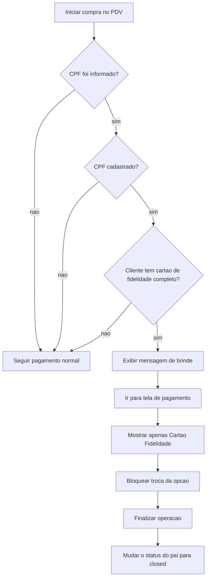
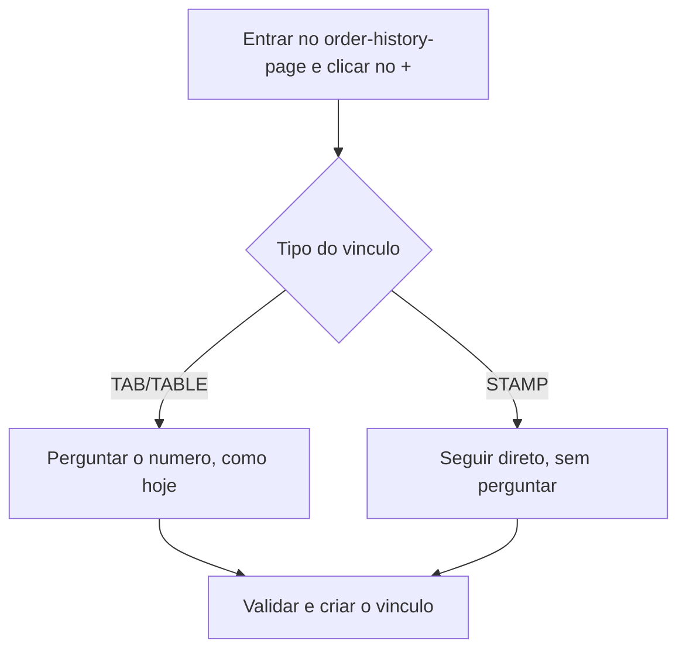

# LoyaltyFlow

Regra do fluxo no PDV:

- Antes do pagamento, o cliente pode informar ou nao o CPF.
- Se informar CPF e o cadastro existir, o sistema verifica se o cartao de fidelidade esta completo.
- Se o cartao estiver completo:
  - exibe a mensagem de brinde;
  - abre a tela de pagamento com apenas `Cartao Fidelidade`;
  - a opcao nao pode ser alterada;
  - finaliza a operacao;
  - depois muda o status do pai para `closed`.
- Se o cartao nao estiver completo, o pagamento segue o fluxo normal.

Regra de entrada no `order-history-page`:

- Ao clicar no `+`, se o tipo for `TAB` ou `TABLE`, o sistema pede o numero exatamente como hoje.
- Se o tipo for `STAMP`, o sistema nao pergunta o numero e segue direto.

Regra de gravacao da fidelidade no `orders`:

- O pedido filho continua como `sale`.
- O pedido pai vira `fidelity` apenas quando a primeira compra elegivel tiver ao menos um produto participante.
- Se a compra nao tiver produto participante, ela nao cria fidelidade e permanece apenas como `sale`.
- Para entrar na conta do carimbo, um filho precisa:
  - estar pago;
  - estar vinculado ao pai fidelidade aberto;
  - ter pelo menos um `order_product` com produto participante.
- Filhos sem produto participante nao contam para o progresso `1/n`.
- O pai precisa permanecer com status `open` para receber novos filhos elegiveis.

Exemplo pratico:

- Login no shop da empresa `6`.
- Compra `72638` filha de `72637`.
- Se `72638` tiver um `order_product` com produto participante, ele conta como carimbo.
- Se nao tiver, nao entra na fidelidade.

Observacoes:

- `sale` e o tipo comercial do filho.
- `fidelity` e o tipo do pai/cartao.
- O criterio de elegibilidade vem dos produtos configurados como participantes da fidelidade.

