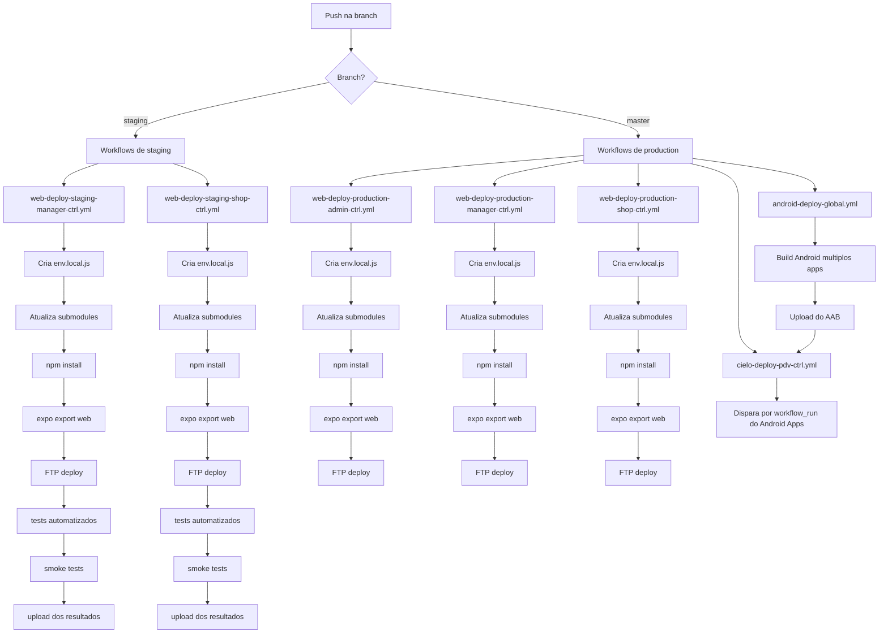

# PushTrigger

Fluxo de disparo dos workflows de GitHub Actions do `app-community` quando ha `push` em `staging` ou `master`.

Observacoes:

- No `master`, os workflows web de `manager` e `shop` continuam dependendo de uma execucao anterior bem-sucedida em `staging` para o mesmo commit ou um de seus parents.
- Os workflows Android de `master` podem acionar os workflows da Cielo via `workflow_run`.
