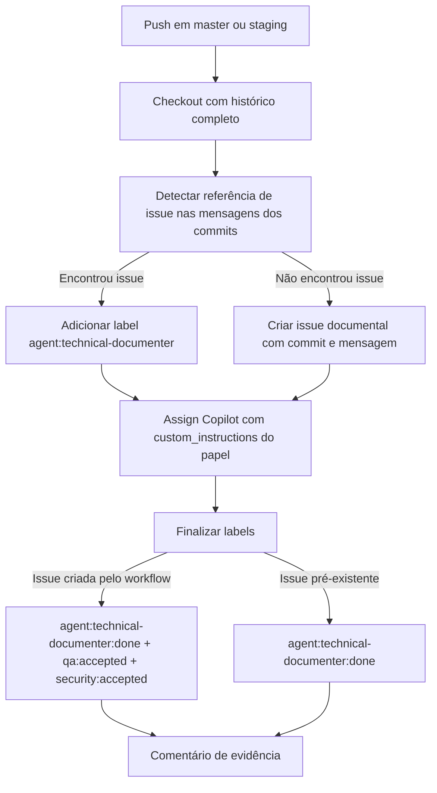

# Technical Documenter workflow

Documentação técnica da automação de pós-push para documentação técnica no `app-community`.

> Cópia operacional no repositório (`docs/technical/github-actions/`). A [wiki do app-community](https://github.com/ControleOnline/app-community/wiki) é a fonte primária de leitura humana. A fonte canônica do **papel** vive em `agents-mcp`.

## Objetivo

Registrar como o repositório abre ou prepara automaticamente a trilha de documentação técnica sempre que houver `push` em `master` ou `staging`.

O fluxo existe para evitar publicação sem rastreabilidade documental:

- se o commit já mencionar uma issue, a issue existente recebe a trilha `technical-documenter`;
- se o commit não mencionar issue fonte, o workflow cria uma issue documental dedicada;
- em ambos os casos a automação deixa instruções explícitas para o Copilot atuar como `technical-documenter`.

## Repositórios e superfícies afetadas

| Módulo / superfície | Papel no fluxo |
| --- | --- |
| `ControleOnline/app-community` | Repositório dono do workflow `.github/workflows/technical-documenter.yml` |
| `ControleOnline/agents-mcp` | Fonte canônica do papel `technical-documenter` e das skills obrigatórias |
| `ControleOnline/app-community/wiki` | Destino primário da documentação técnica publicada para humanos |
| GitHub Issues do próprio repositório | Fila operacional do fluxo documental |

## Gatilho

Arquivo: `.github/workflows/technical-documenter.yml`

```yaml
on:
  push:
    branches: [master, staging]
```

O workflow roda em `push` para `master` **e** `staging` (diferente de alguns submódulos que disparam só em `master`).

## Fluxo operacional

```text
push (master|staging)
  -> checkout (fetch-depth: 0)
  -> scan mensagens dos commits no range before..sha
  -> encontrou referência #N ?
       sim -> edita issue N (label agent:technical-documenter) + assign Copilot
       não -> cria issue "docs: documentação técnica automática..." + assign Copilot
  -> finalize labels
       issue criada pelo workflow: agent:technical-documenter:done + qa:accepted + security:accepted
       issue pré-existente: agent:technical-documenter:done (+ remove agent:technical-documenter)
  -> comentário de evidência na issue
```



## Detecção de issue fonte

O job varre as mensagens do range `github.event.before..github.sha` (fallback: último commit) com o padrão:

```text
([A-Za-z0-9_.-]+/[A-Za-z0-9_.-]+)?#([0-9]+)
```

A primeira ocorrência define `issue_number`. Se nenhuma for encontrada, o workflow cria uma issue com título no formato:

```text
docs: documentação técnica automática (push <branch> <sha curto>)
```

e corpo apontando o commit, a mensagem e a instrução canônica do papel `technical-documenter`.

## Assign do Copilot

Em ambos os caminhos (issue existente ou criada), o workflow:

1. aplica `agent:technical-documenter` (quando aplicável);
2. chama a API de assignees com `copilot-swe-agent[bot]` e `agent_assignment` contendo `custom_instructions` que **obrigam** a leitura de:
   - `https://raw.githubusercontent.com/ControleOnline/agents-mcp/master/agents/roles/technical-documenter/agent.md`
   - skills referenciadas (wiki técnica como fonte primária);
3. proíbe implementação de código de produto na passagem documental.

Worker composite relacionado (usado também pelo manager-worker): `.github/actions/workers/technical-documenter/action.yml`.

## Labels e governança

| Situação | Labels finais típicas |
| --- | --- |
| Issue **criada** pelo workflow | `agent:technical-documenter:done`, `qa:accepted`, `security:accepted` |
| Issue **pré-existente** referenciada no commit | `agent:technical-documenter:done` (remove `agent:technical-documenter`) |

Regras de papel e fila documental: `agents-mcp` → `agents/roles/technical-documenter/agent.md` e `agents/skills/shared/operations/issue-queue-discovery.md`.

O Manager **não** deve reprocessar issues já marcadas com `agent:technical-documenter:done` (comentário de evidência deixa isso explícito nas issues criadas pelo workflow).

## Relação com o PushTrigger

O diagrama operacional de deploys em `docs/pushtrigger.md` inclui este workflow nos ramos `staging` e `master` como automação de governança documental (não é deploy de runtime).

## Verificação manual

Checklist mínimo quando esse workflow mudar:

1. validar se o `push` em `master` e em `staging` continua acionando o job;
2. conferir se commits com `#issue` reaproveitam a issue correta;
3. conferir se commits sem referência criam a issue `docs: documentação técnica automática...`;
4. revisar se as labels finais e o comentário esperado continuam sendo aplicados;
5. confirmar se o texto de `custom_instructions` ainda aponta para a fonte canônica em `agents-mcp`.

## Links cruzados

| Destino | URL |
| --- | --- |
| Wiki do app | https://github.com/ControleOnline/app-community/wiki |
| Fonte canônica do papel | https://github.com/ControleOnline/agents-mcp/blob/master/agents/roles/technical-documenter/agent.md |
| Workflow | `.github/workflows/technical-documenter.yml` |
| Worker composite | `.github/actions/workers/technical-documenter/action.yml` |
| PushTrigger (diagrama de deploys) | `docs/pushtrigger.md` |
| Issue de origem desta documentação | https://github.com/ControleOnline/app-community/issues/386 |
| PR legado (plano Copilot, supersedido) | https://github.com/ControleOnline/app-community/pull/387 |
